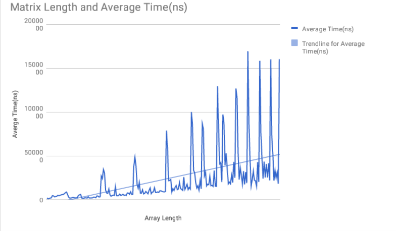
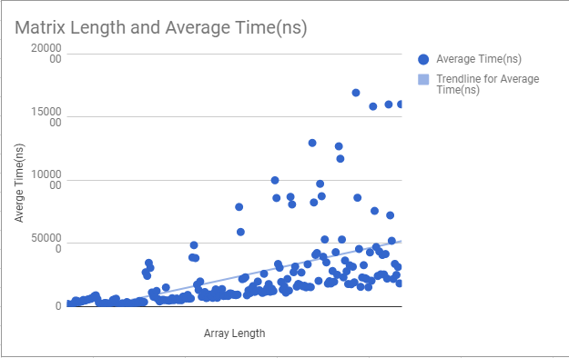

# Testing Runtime of Matrix-Finder Algorithm

###### Macaroni(Aidan Griffin, Ahnaf Hasan, Colin Hosking)
###### APCS2
###### Lab#00 -- But What Does the Data Say?
###### 2018-02-09

#### Our Hypothesis:
The algorithm, finding an item in a n x n matrix, runs on linear runtime O(n).
This means as n increases, the runtime of the algorithm will increase in direct proportion.

#### Background:
Preconditions:
* items in the n x n matrix ascend left to right
* items in the n x n matrix ascend top to bottom
* if the target item is found, return its coordinates (row #,column #)
* if the target item is not found, return (-1,-1)

 Our Algorithm: 
 Starting from the bottom left corner, the finder goes
 through by checking the number and moving
 right or up if the desired number is
 smaller or larger than the array number,
 respectively. Breaks if column or row is too big.

Worst Case:
Our algorithm's worst case occurs when the target item is in the top right corner of the matrix.
This is because our algorithm starts its search from the bottom left corner, and the farthest item will take the longest to reach. We calculated the number of comparisons to reach the top right corner to be 2n-1.

#### Experiment:
Our experiment tested the runtime in nanoseconds of large n * n Matrix data sets. 
We start with n = 1000, and the value of n increases at a constant rate of 50 until n = 10000. 
We conducted three trials for each value of n and averaged the results of the three trials to collect more accurate data. 

In order to collect the data, we stored temporary long variable that calculate the nanoTime before running the algorithm and compute the nanoTime after running the algorithm subtractd by the previous nanoTime value. We made sure that we were not including the runtime of the algorithm that populated and generated the matrices in our nanoTime calculation.

We decided to always test the worst case for each n, because the worst case of an algorithm determines its overall runtime.

#### Results 
Our data, when graphed, resembles a line with small slope, but with spikes sticking up from it.

We got repeating spikes in the data whose peaks are at 2700, 4150, 5500, 6650, 7850, 8650, 9150, 9600, 10000. The interesting thing about these peaks is that the difference between peaks is always decreasing from 1450 to 1350 to 1150 and so on. It was especially surprising to see that the peaks at which the average time was the highest were not in any form of an arithmetic/linear progression.

#### Conclusion
Ignoring the large spikes, our data resembles a line, as shown with the trend line.
